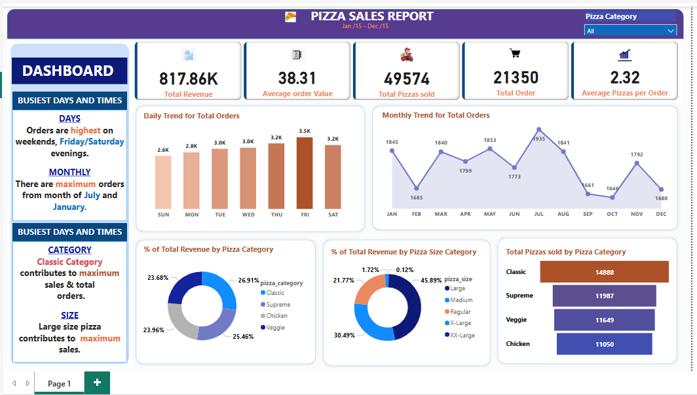

# Pizza Sales – SQL & Power BI

## Dashboard Preview


This dashboard provides a comprehensive view of pizza sales, including:
- **KPIs** like Total Revenue, Total Pizzas Sold, Average Order Value
- **Trends** by day and month
- **Category and Size Breakdown**
- **Top Selling Pizzas**

---

## Project Overview
Quick analytics project to explore pizza sales using **SQL Server** (queries) and a **Power BI** report (`Pizza.pbix`). The focus is on core KPIs and a handful of trends and rankings.

---

## Files
- `Pizza.pbix` — Power BI report (connect it to your database table `pizza_sales`).
- `README.md` — this guide.

---

## Table & Columns (expected)
Single fact table: **pizza_sales**
- `order_id` (int)
- `order_date` (date/datetime)
- `pizza_name` (text)
- `pizza_category` (text)
- `pizza_size` (text)
- `quantity` (int)
- `total_price` (decimal)

> The SQL uses `DATENAME()` and `MONTH()` — written for **SQL Server**. Adapt date functions if using another SQL dialect.

---

## How to Use
1. **Database**
   - Ensure the table **pizza_sales** exists with the columns above.
2. **Run SQL (KPI & Trends)**
   - Execute the snippets below in SQL Server (SSMS / Azure Data Studio). You can paste them into views for Power BI.
3. **Power BI**
   - Open `Pizza.pbix` → Update the data source to your DB → Refresh.
   - Build visuals from the views/queries or import the table directly.

---

## Core SQL Snippets (minimal)
### A) KPIs
```sql
-- 1) Total Revenue
SELECT SUM(total_price) AS Total_Revenue FROM pizza_sales;

-- 2) Average Order Value
SELECT SUM(total_price) / COUNT(DISTINCT order_id) AS Avg_Order_Value FROM pizza_sales;

-- 3) Total Pizzas Sold
SELECT SUM(quantity) AS Total_Pizza_Sold FROM pizza_sales;

-- 4) Total Orders
SELECT COUNT(DISTINCT order_id) AS Total_Orders FROM pizza_sales;

-- 5) Average Pizzas per Order
SELECT CAST(CAST(SUM(quantity) AS DECIMAL(10,2)) / 
            CAST(COUNT(DISTINCT order_id) AS DECIMAL(10,2)) AS DECIMAL(10,2)) AS Avg_Pizzas_Per_Order
FROM pizza_sales;
```

### B) Daily Trend (orders by weekday)
```sql
SELECT DATENAME(WEEKDAY, order_date) AS order_day,
       COUNT(DISTINCT order_id) AS total_orders
FROM pizza_sales
GROUP BY DATENAME(WEEKDAY, order_date);
```

### C) Monthly Trend (orders by month name)
```sql
SELECT DATENAME(MONTH, order_date) AS month_name,
       COUNT(DISTINCT order_id) AS total_orders
FROM pizza_sales
GROUP BY DATENAME(MONTH, order_date);
```

### D) % Sales by Category
```sql
SELECT pizza_category,
       CAST(SUM(total_price) AS DECIMAL(10,2)) AS total_revenue,
       CAST(SUM(total_price) * 100.0 / (SELECT SUM(total_price) FROM pizza_sales) AS DECIMAL(10,2)) AS pct
FROM pizza_sales
GROUP BY pizza_category;
```

### E) % Sales by Size
```sql
SELECT pizza_size,
       CAST(SUM(total_price) AS DECIMAL(10,2)) AS total_revenue,
       CAST(SUM(total_price) * 100.0 / (SELECT SUM(total_price) FROM pizza_sales) AS DECIMAL(10,2)) AS pct
FROM pizza_sales
GROUP BY pizza_size
ORDER BY pizza_size;
```

### F) Total Pizzas Sold by Category (example: February)
```sql
SELECT pizza_category,
       SUM(quantity) AS total_quantity_sold
FROM pizza_sales
WHERE MONTH(order_date) = 2
GROUP BY pizza_category
ORDER BY total_quantity_sold DESC;
```

### G) Top 5 Pizzas by Revenue
```sql
SELECT TOP 5 pizza_name, SUM(total_price) AS total_revenue
FROM pizza_sales
GROUP BY pizza_name
ORDER BY total_revenue DESC;
```

---

## Tips
- For calendar sorting in Power BI, also include `MONTH(order_date)` and sort the month name by the numeric month.
- Save each query as a **view** (e.g., `vw_kpi_totals`, `vw_orders_by_weekday`) to simplify Power BI refreshes.
- Add slicers in Power BI for **date**, **category**, and **size** to filter all visuals.

---

## Author
Mahbubur Rahman · m.rahman1091@gmail.com
